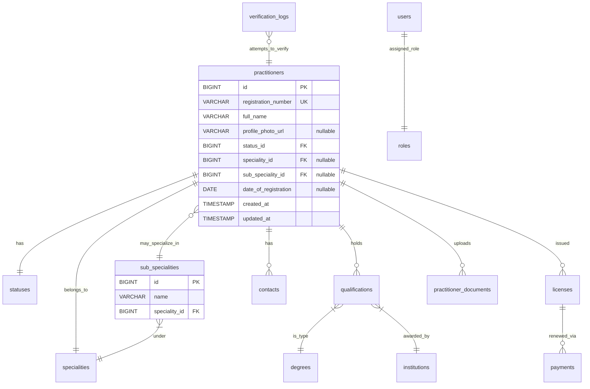

# 🩺 KMPDC Seeder

[](https://packagist.org/packages/kdbz/kmpdc-seeder)
[](https://packagist.org/packages/kdbz/kmpdc-seeder)
[](LICENSE)
[](https://laravel.com)
[](https://www.php.net)


A **Laravel 12+ package** for scraping, cleaning, and importing practitioner data from the **Kenya Medical Practitioners and Dentists Council (KMPDC)** master register.

This package is designed for:

- 🧑‍🏫 Teaching structured data ingestion and seeding in Laravel 

---

## 🚀 Features

✅ Scrapes KMPDC register HTML into structured CSVs  
✅ Extracts & normalizes:
- Practitioner details, qualifications, degrees, institutions  
✅ Imports structured data into related tables  
✅ Works seamlessly with Eloquent models  

---

## 📦 Installation

```bash
composer require kdbz/kmpdc-seeder
````
---

## 🧩 Database Schema

The package models relationships between practitioners, qualifications, degrees, institutions, and related entities.



> 📝 **Notes**
> * All inserts and relationships are handled via **Eloquent models**

---

## 🔁 Workflow Overview

This package processes practitioner data in **three main stages**:

| Step | Command | Input → Output | Description |
|------|----------|----------------|-------------|
| 🧭 **1. Sync** | `php artisan kmpdc:sync` | Web data → timestamped CSV file | Crawls the KMPDC register and generates a **timestamped CSV** file containing all practitioners' details (name, registration number, qualifications, address, status, speciality, etc.). |
| 🧮 **2. Extract** | `php artisan kmpdc:extract` | CSV → JSON files | Parses the latest CSV, extracts structured data (degrees, institutions, statuses, specialities), and saves normalized JSON files. |
| 📥 **3. Import** | `php artisan kmpdc:import` | JSON files → Database | Imports structured data into your Laravel models, preserving relationships and handling duplicates safely. |

> 🧩 **Run in this order:** `sync → extract → import`

---

## 🧭 Step 1 — Sync (Generate CSV)

The sync command crawls the KMPDC register and saves a **timestamped CSV** file to your Laravel `storage` directory.

```bash
php artisan kmpdc:sync
````

**Output Example:**

```
storage/app/kmpdc-data/csv
└── 2025_10_25_122105_kmpdc_practitioners.csv
```

Each run produces a uniquely named file based on the timestamp, ensuring previous syncs remain preserved.

**Included columns:**

* Fullname
* Registration Number
* Address
* Qualifications
* Discipline / Speciality
* Sub-speciality
* Status
* Profile link

---

## 🧮 Step 2 — Extract (Generate JSON)

The extract command reads the **latest timestamped CSV** and produces clean, structured JSON files.

```bash
php artisan kmpdc:extract
```

---

## 📥 Step 3 — Import (Save to Database)

Imports the normalized JSON into your relational schema.

```bash
php artisan kmpdc:import
```

---

## 🧠 Verify Imports

You can verify successful import via Tinker:

```bash
php artisan tinker
```

```php
use App\Models\Practitioner;

Practitioner::with(['status', 'speciality', 'subSpeciality', 'qualifications'])->first();
```
---

### Examples

```php
use App\Models\Practitioner;

// Fetch one doctor
$doctor = Practitioner::with(['status', 'speciality', 'subSpeciality', 'qualifications.degree', 'qualifications.institution'])->first();

$doctor->full_name;             // "Dr JOHN DOE"
$doctor->status->name;          // "ACTIVE"
$doctor->speciality?->name;     // "SURGERY"
$doctor->subSpeciality?->name;  // "CARDIOLOGY"

// Get all unique institutions
\App\Models\Institution::pluck('name');

// Find all practitioners under Internal Medicine
\App\Models\Practitioner::whereHas('speciality', fn($q) => $q->where('name', 'INTERNAL MEDICINE'))->count();
```

---

## 🤝 Contributing

1. Fork the repository
2. Create your feature branch (`git checkout -b feature/my-feature`)
3. Commit your changes (`git commit -m 'Add my feature'`)
4. Push to your branch (`git push origin feature/my-feature`)
5. Open a Pull Request 🎉

---

## 🏛️ Acknowledgement & Disclaimer

This package utilizes **publicly accessible practitioner data** from the  
official **[Kenya Medical Practitioners and Dentists Council (KMPDC)](https://kmpdc.go.ke/)** website.

The author, **KDBZ**, is **not affiliated with, endorsed, or sponsored by KMPDC**.  
All practitioner data, formats, and associated intellectual property remain the exclusive property of KMPDC.

This project is provided **solely for educational, analytical, and research purposes**.  
It is not intended for redistribution, resale, or use in any commercial or official capacity.

Users are responsible for ensuring that their use of this tool complies with:
- The **KMPDC website’s terms of service**
- Applicable **data protection and privacy laws**
- Relevant **ethical and professional standards**

> For any **commercial or institutional use**, explicit authorization should be sought directly from **KMPDC**.


## 📜 License

This package is open-sourced software licensed under the [MIT license](LICENSE).

---

**Author:** [KDBZ](https://github.com/kdbz)
**Repository:** [https://github.com/kdbz/kmpdc-seeder](https://github.com/kdbz/kmpdc-seeder)

---